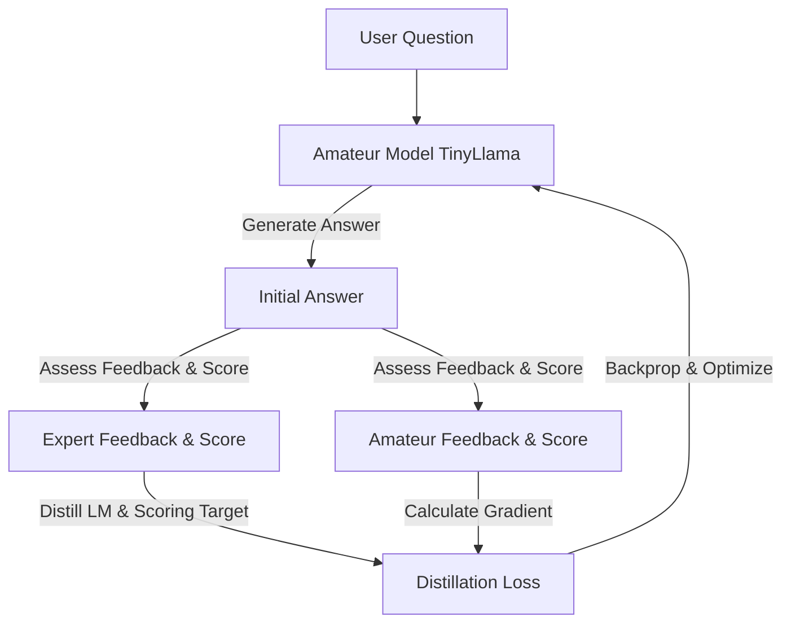
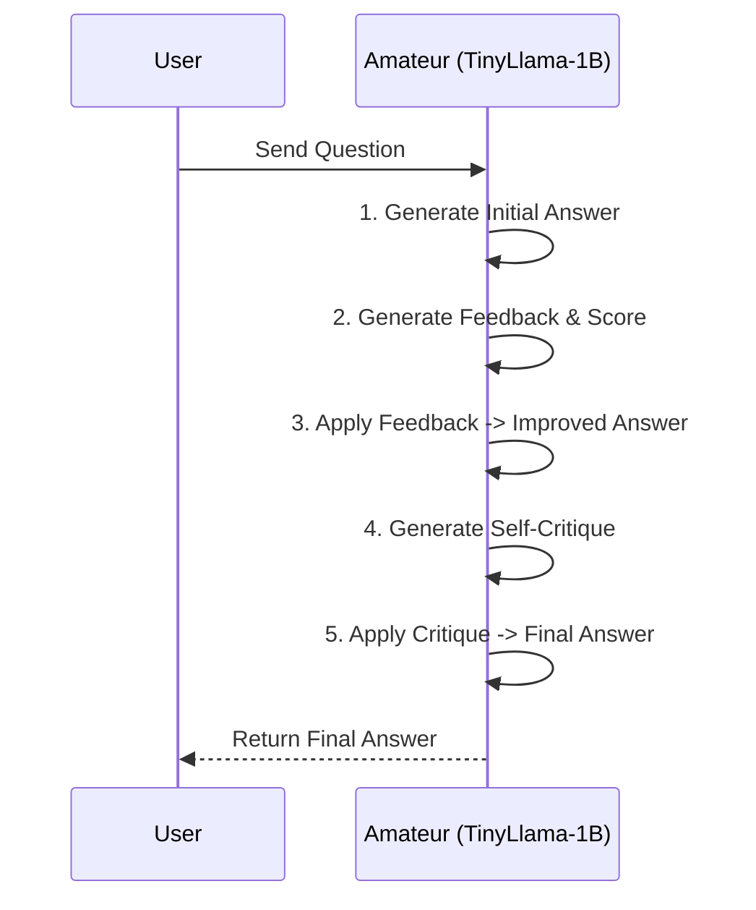

# MAAH-revive: Self-Critique Knowledge Distillation

MAAH-revive is a high-performance Knowledge Distillation (KD) framework designed to optimize, stabilize, and compress reasoning pipelines. It teaches a smaller, cost-effective **Amateur model** (TinyLlama-1B) to generate high-quality self-critiques and iterative refinements for its own answers, eliminating the high inference latency and cost of a large **Expert model** (LLaMA-8B) at evaluation time.

---

## 🏗️ Repository Architecture

This codebase is organized using a hybrid monorepo structure. Heavy-duty machine learning algorithms and evaluation logic are isolated in version-controlled Python modules under the `core/` folder, while interactive driver notebooks are kept lightweight.

```text
MAAH-revive/
├── core/
│   ├── models.py        # Model wrappers for Expert, Amateur, and Parsers
│   ├── losses.py        # Core distillation loss functions (LM, Hidden, Scoring, Logit)
│   ├── evaluate.py      # Statistical validation and readability/perplexity/NLI metrics
│   ├── network.py       # Knowledge distillation training controller
│   └── utils.py         # Adaptive weighting policies and cost/resource tracking
├── Phase1_Stabilization.ipynb   # Streamlined driver notebook for Phase 1 ablations
├── docs/                # Ignored by Git. Contains legacy documentation and meeting transcripts
└── .gitignore           # Ignores docs/, temporary outputs, and binary assets
```

---

## 🔄 Self-Critique Distillation Pipeline

During training, the framework coordinates interactions between the Expert and Amateur models to distill critique and score generation capabilities.



---

## ⚡ Phase 1 Improvements: Benchmarking & Stabilization

Phase 1 focuses on stripping unnecessary overhead, stabilizing training metrics, and proving standalone efficiency:

### 1. Loss Function Ablation
Complex setups with 4+ competing losses often lead to scale mismatches and gradient competition. In Phase 1, we ablate all auxiliary losses to run **solely on Language Modeling Loss (`lm_loss`)**:
* Set up in driver via `loss_flags = [True, False, False, False]`.
* Focuses parameters entirely on high-quality text representation.

### 2. Amateur-Only Inference Pipeline
Instead of relying on the Expert model to condense feedback and evaluate refinements, the distilled Amateur model operates completely autonomously during evaluation:



### 3. VRAM, Latency & FLOP Cost Tracking
A built-in `ResourceTracker` calculates efficiency gains in real-time, validating the distillation:
* **Peak VRAM Tracking:** Monitors peak GPU memory allocations (in MB).
* **Execution Latency:** Measures wall-clock time per query (in seconds).
* **Estimated FLOPs:** Approximates compute budget using $2 \times \text{Parameters} \times \text{Generated Tokens}$.

---

## 🚀 Remote Setup & Getting Started

### 1. Installation & Virtual Environment Setup
To isolate the framework from system-level python package conflicts on the remote server, set up a virtual environment and install the verified packages:

```bash
# 1. Create the virtual environment
python -m venv .venv

# 2. Activate the virtual environment
source .venv/bin/activate

# 3. Install the exact direct dependencies in isolated mode
pip install --isolated --no-user -r requirements.txt

# 4. Download the required SpaCy English linguistic model
python -m spacy download en_core_web_sm
```

### 2. Running on the Remote SSH GPU Setup
Since the models (`meta-llama/Llama-3.1-8B-Instruct` and `meta-llama/Llama-3.2-1B-Instruct`) are gated, you must provide your Hugging Face access token. 

#### Running the Script Directly:
To run the script asynchronously in the background using the remote virtual environment and save the execution outputs:
```bash
HF_TOKEN="your_huggingface_token_here" .venv/bin/python Phase1_Stabilization.py > test_output.txt 2>&1 &
```

#### Monitoring Execution:
To track the progress, download status, or logs in real-time, run:
```bash
tail -f test_output.txt
```

---

## 📂 Output Locations
* **Execution Log / Console Outputs:** Saved in the workspace root at `test_output.txt` (via standard redirect).
* **Model Cache:** Downloaded Hugging Face model weight shards are stored in your home directory at `~/.cache/huggingface/hub/`.

---

## 🧠 Experimental & Baseline Strategy (Next Steps)

Based on Advisor Michael Saxon's key recommendations, here is the roadmap for establishing a strong, elegant, and publishable baseline:

### 📊 How many rows do we run?
**10k rows is unnecessary and highly compute-expensive.** 
* A sample size of **300 to 1,000 samples** (such as using a dataset like `300_sample.jsonl`) is the sweet spot.
* Since our evaluation pipeline uses a frequentist **paired t-test** (across metrics like readability, semantic similarity, perplexity, and NLI entailment), **300–1,000 samples provide more than enough statistical power** to achieve a highly reliable $p$-value ($p < 0.05$).
* 10k rows would take hours to run, significantly slowing down iteration speed without adding statistical value.

### 🧪 Next Steps to Set Up a Strong Baseline

To prove the core value of our distilled framework, we must evaluate and compare the following **four configurations**:

1. **Base Amateur (No Critique)**: The raw unrefined `TinyLlama-1B` generating answers directly.
2. **Base Amateur (With Critique, Un-distilled)**: The raw `TinyLlama-1B` running the self-critique loop *before* training. *(This proves if the critique format itself helps a small model without fine-tuning).*
3. **Distilled Amateur (With Critique)**: Our fine-tuned `TinyLlama-1B` executing the self-critique loop autonomously. *(This is our proposed method).*
4. **Original CLEAR Setup**: The multi-model setup (Expert `LLaMA-8B` + Amateur `TinyLlama-1B`). *(This represents the upper bound).*

#### Core Story to Pitch:
> *"We simplified the complex, high-overhead multi-model CLEAR setup by compressing the entire feedback loop into a single cheap model (TinyLlama). By distilling feedback, the standalone distilled model achieves an **X% performance boost** over the base model, matching the expensive CLEAR framework at a fraction of the VRAM, Flops, and API latency costs."*

---

## 📊 Current Status & Next Steps

We successfully ran a **15-sample test** on the `openai/gsm8k` dataset to evaluate all four configurations:
* **Config 1 (Base, No Critique):** `20.00%` accuracy
* **Config 2 (Base, Critique, Un-distilled):** `26.67%` accuracy
* **Config 3 (Distilled Amateur):** `13.33%` accuracy *(overfitted on truncated samples)*
* **Config 4 (Original CLEAR):** `26.67%` accuracy

### 🛠️ Key Takeaways & Action Items:
1. **Self-Critique Works:** Adding un-distilled self-critique (Config 2) boosted accuracy by **+6.67%**, matching the multi-model CLEAR setup.
2. **Overcome Overfitting:** The drop in Config 3 shows catastrophic forgetting due to a tiny training size (5 samples). We must scale our SFT training set to **300–1000 samples** to stabilize and generalise.
3. **Scale Up to Multi-GPU:** Using our **2x NVIDIA RTX 3090 GPU** setup, we can distribute models across GPUs (e.g. Teacher on GPU 0, Student + NLI on GPU 1) or parallelise training via Hugging Face `accelerate`, making a full **1,000-sample benchmark run completely in under 25 minutes**!

*(For full details and estimations, view [detailed_results.md](detailed_results.md)).*


