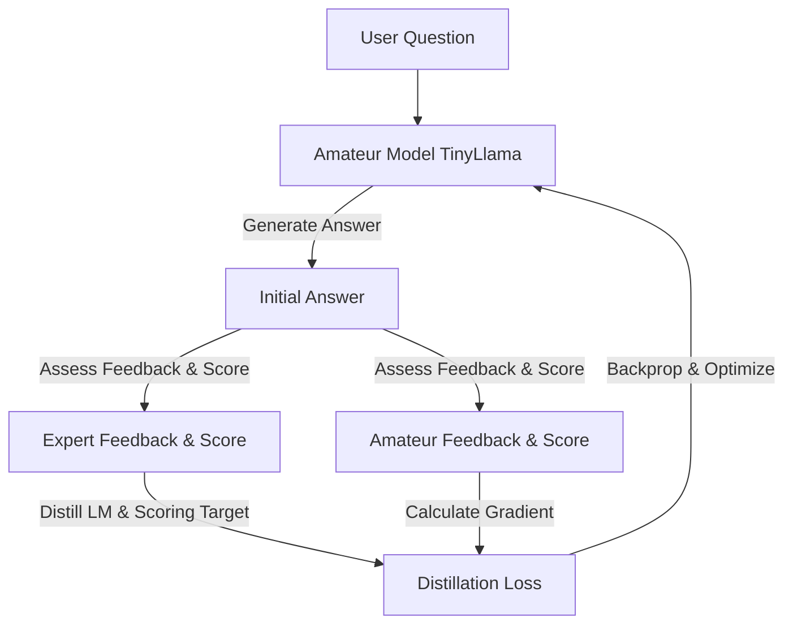
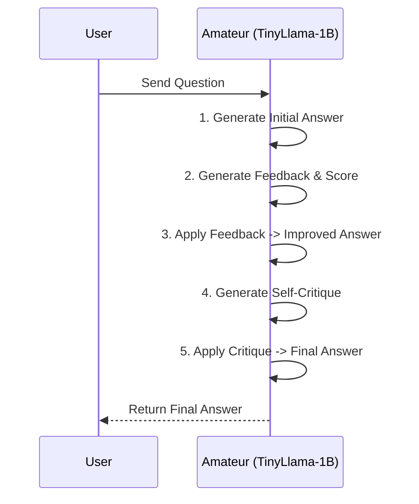

# MAAH-revive: Self-Critique Knowledge Distillation

MAAH-revive is a high-performance Knowledge Distillation (KD) framework designed to optimize, stabilize, and compress reasoning pipelines. It teaches a smaller, cost-effective **Amateur model** (TinyLlama-1B) to generate high-quality self-critiques and iterative refinements for its own answers, eliminating the high inference latency and cost of a large **Expert model** (LLaMA-8B) at evaluation time.

---

## 🏗️ Repository Architecture

This codebase is organized using a hybrid monorepo structure. Heavy-duty machine learning algorithms and evaluation logic are isolated in version-controlled Python modules under the `core/` folder, while interactive driver notebooks are kept lightweight.

```text
MAAH-revive/
├── core/
│   ├── models.py        # Model wrappers for Expert, Amateur, and Parsers
│   ├── losses.py        # Core distillation loss functions (LM, Hidden, Scoring, Logit)
│   ├── evaluate.py      # Statistical validation and readability/perplexity/NLI metrics
│   ├── network.py       # Knowledge distillation training controller
│   └── utils.py         # Adaptive weighting policies and cost/resource tracking
├── Phase1_Stabilization.ipynb   # Streamlined driver notebook for Phase 1 ablations
├── docs/                # Ignored by Git. Contains legacy documentation and meeting transcripts
└── .gitignore           # Ignores docs/, temporary outputs, and binary assets
```

---

## 🔄 Self-Critique Distillation Pipeline

During training, the framework coordinates interactions between the Expert and Amateur models to distill critique and score generation capabilities.



---

## ⚡ Phase 1 Improvements: Benchmarking & Stabilization

Phase 1 focuses on stripping unnecessary overhead, stabilizing training metrics, and proving standalone efficiency:

### 1. Loss Function Ablation
Complex setups with 4+ competing losses often lead to scale mismatches and gradient competition. In Phase 1, we ablate all auxiliary losses to run **solely on Language Modeling Loss (`lm_loss`)**:
* Set up in driver via `loss_flags = [True, False, False, False]`.
* Focuses parameters entirely on high-quality text representation.

### 2. Amateur-Only Inference Pipeline
Instead of relying on the Expert model to condense feedback and evaluate refinements, the distilled Amateur model operates completely autonomously during evaluation:



### 3. VRAM, Latency & FLOP Cost Tracking
A built-in `ResourceTracker` calculates efficiency gains in real-time, validating the distillation:
* **Peak VRAM Tracking:** Monitors peak GPU memory allocations (in MB).
* **Execution Latency:** Measures wall-clock time per query (in seconds).
* **Estimated FLOPs:** Approximates compute budget using $2 \times \text{Parameters} \times \text{Generated Tokens}$.

---

## 🚀 Getting Started

### Installation & Virtual Environment Setup
To isolate the framework from system-level python package conflicts, set up a virtual environment and install the exact verified package versions:

```bash
# 1. Create the virtual environment
python -m venv .venv

# 2. Activate the virtual environment
# On Windows (PowerShell):
.venv\Scripts\Activate.ps1
# On macOS/Linux:
source .venv/bin/activate

# 3. Install the exact direct dependencies in isolated mode
pip install --isolated --no-user -r requirements.txt

# 4. Download the required SpaCy English linguistic model
python -m spacy download en_core_web_sm
```

### Running the Benchmarks
1. Open the [Phase1_Stabilization.ipynb](Phase1_Stabilization.ipynb) notebook in Jupyter or your favorite IDE.
2. Select the `.venv` virtual environment as your Jupyter kernel interpreter.
3. Ensure you have the `300_sample.jsonl` dataset (or let the notebook default to the built-in fallback mock samples).
4. Run the cells sequentially to experience the amateur-only critique pipeline and visualize the real-time resource cost savings!
